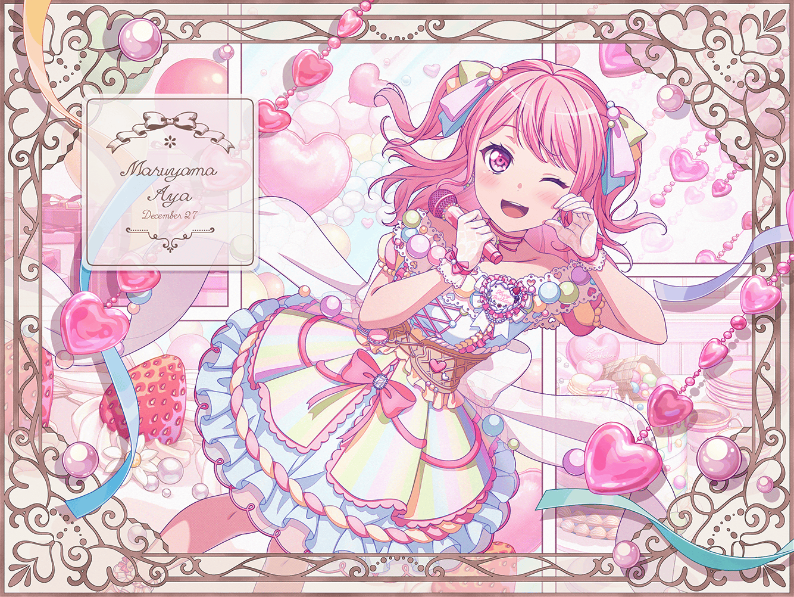

# 🎉 欢迎使用 Aya


欢迎您使用 Aya！

Aya 是基于QQNT协议/注入的开源框架，与HoshinoBot、Yobot\_remix、Yunzai等开源项目，并加以个性化修缮后的QQ机器人。功能针对公主连结简体字版特化，同时又提供便利工具、娱乐工具等。托管于腾讯云2C4G高性能~~土豆~~服务器。

Aya 的形象来源于 [BanG Dream! Project](https://zh.moegirl.org.cn/Bangdream) 的丸山彩（Maruyama Aya）。



你可以在左侧目录选择对应的帮助文档进行浏览。

所有指令的**`@bot`**和**`彩彩`**一般可以互相替换。


<figure><figcaption>
BanGDream official
</figcaption></figure>

SICSOMB\~]NVIV.png)

&#x20;~~\*Aya 的现实中之人~~ [~~前岛亚美小姐~~](https://zh.moegirl.org.cn/%E5%89%8D%E5%B2%9B%E4%BA%9A%E7%BE%8E) ~~于2022年8月24日后推特停止更新，2022年11月宣布艺能活动被迫终止，至今事务所方未有一个合理解释，但每一个彩推会永远记得。希望她一切安好！~~

2023年9月1日宣布更换事务所并复归🎉
